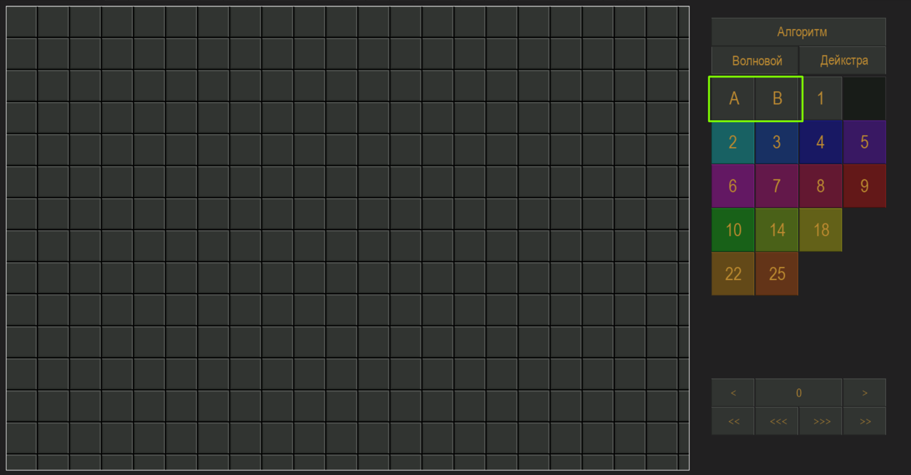
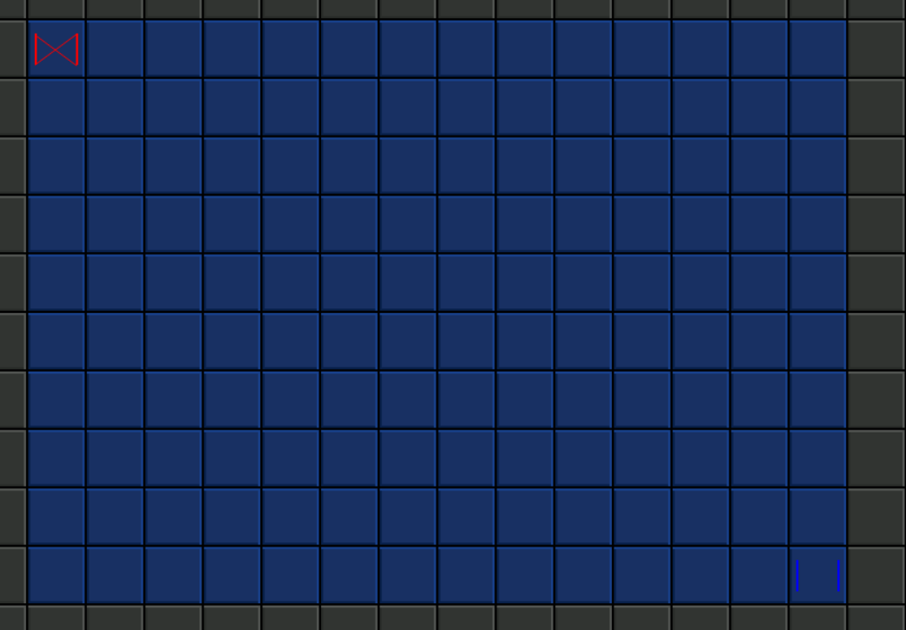
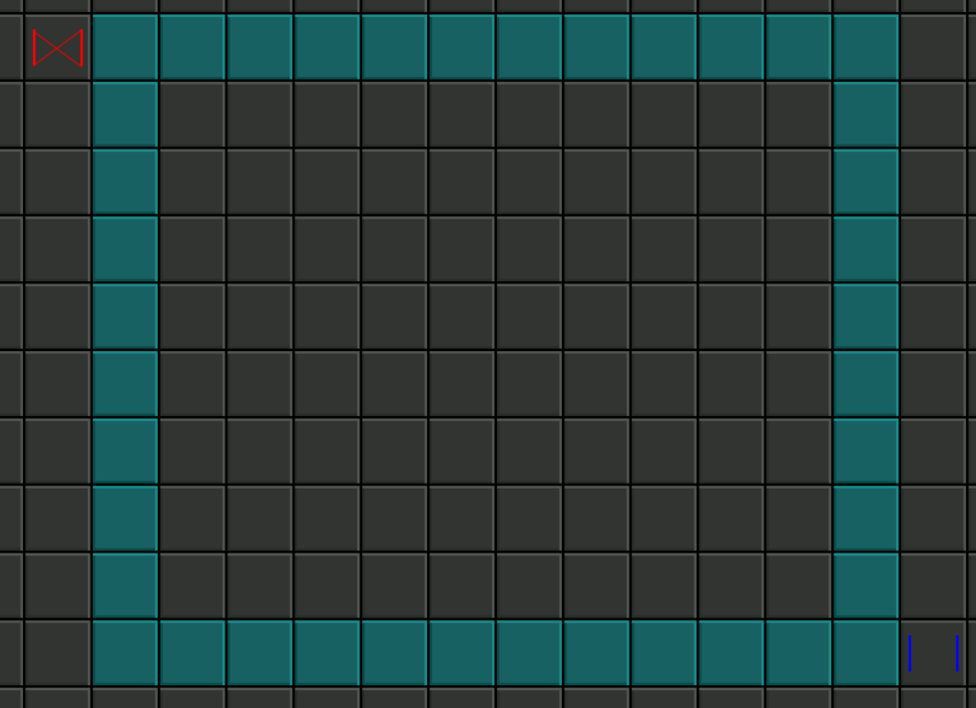
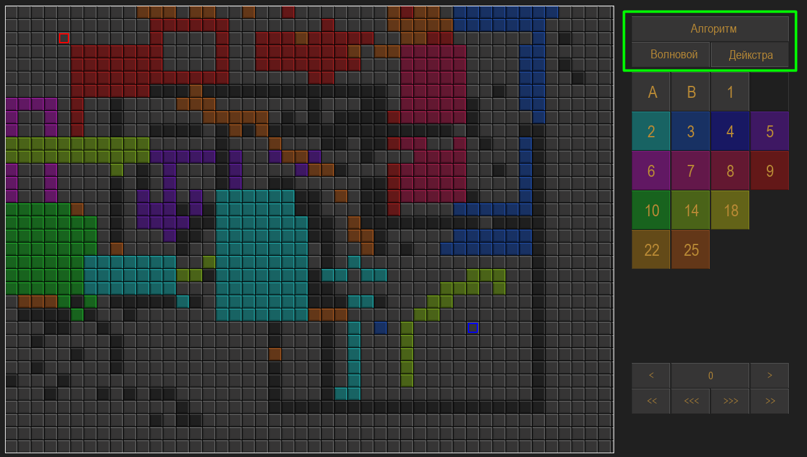
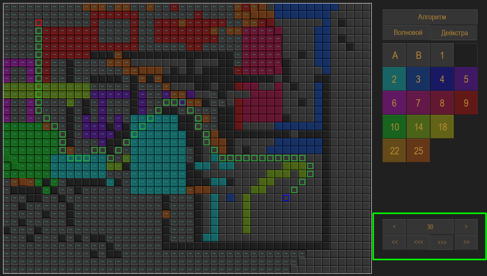
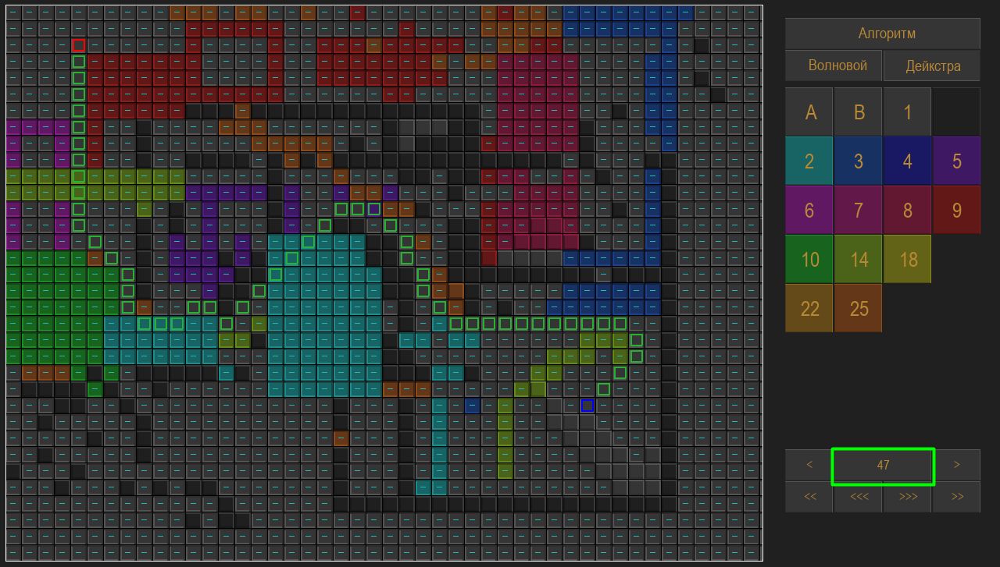

### Управление

| Клавиши | Действия|
|---------|---------|
| Колесико мыши | Приближение и отдаление |
| ЛКМ | покраска клетки в желаемый цвет |
| ПКМ или shift + ЛКМ | перемещение по полю |
| ЛКМ + Ctrl | рисует закрашенный прямоугольник с углами в точках клика |
| ЛКМ + R | рисует не закрашеный прямоугольник с углами в точках клика |
| 1 | быстрая клавиша старта |
| 2 | быстрая клавиша конца |

### Пример

Мышкой выберите начало(А) и конец(B). Это также можно сделать и на клавиши 1 и 2

Разместите их на поле, после чего займитесь раскраской поля, аналогичным образом выбирая желаемый цвет и размещая его на поле. 
Цифра на цветных кнопках означает сложность перехода в эту клетку.
Если вы желаете закрасить прямоугольник, то удерживая клавишу ctrl,кликните на две точки, которые будут его противоположными концами

Если вы желаете нарисовать полый прямоугольник, то вместо ctrl зажмите R

После того, как вы нарисовали все желаемое, выберите алгоритм.
Напоминаю, волновой алгоритм не принимает во внимание веса клеток. Только их проходимость.

После размещения старта и конца и выбора алгоритма станет доступен проигрыватель
На стрелочки можно управлять ходом алгоритма. 
Левые – в прошлое
Правые – в будущее
Количество стрелок характеризует скорость
На счетчике указан текущий кадр

Если алгоритм уже начал работу, то менять что-либо на карте нельзя.
Нужно сначала сбросить счетчик кадров, нажав на него.

Тогда прогресс поиска пути пропадет и можно будет внести коррективы в карту